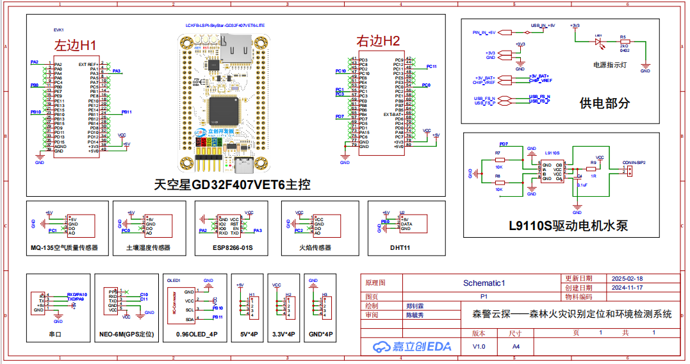
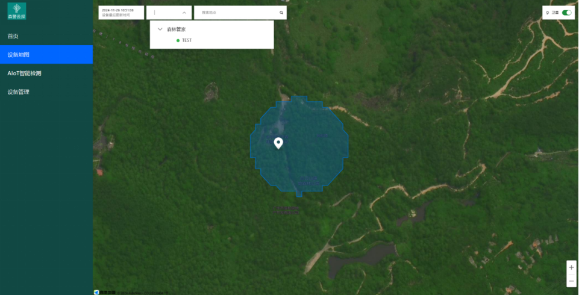
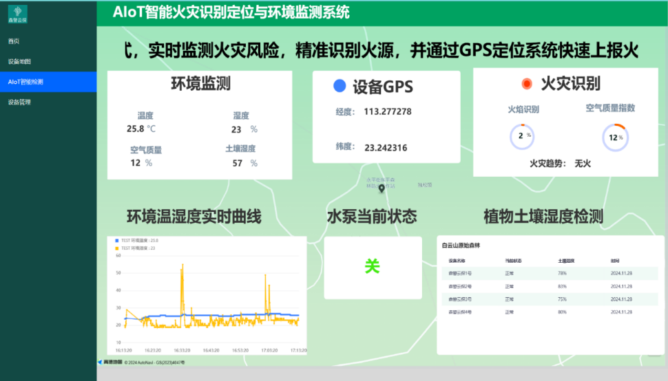
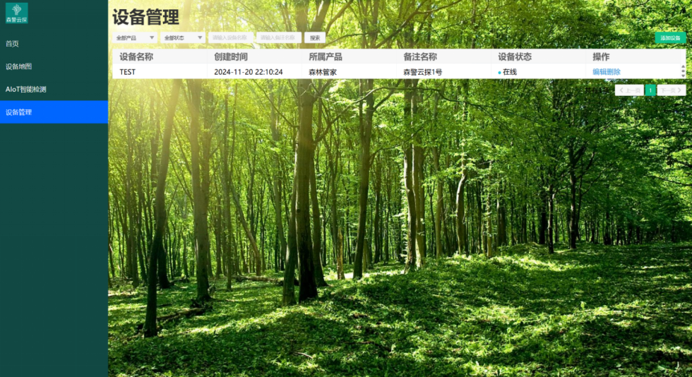
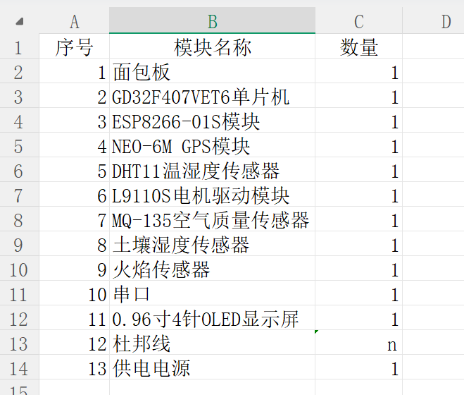

本系统基于AIoT技术，采用天空星GD32F407VET6作为控制中心，与ESP8266-01S、NEO-6M、DHT11、MQ-135、火焰传感器、土壤湿度传感器、OLED显示屏、L9110电机驱动、水泵装置和阿里云物联网应用开发（IoT Studio）平台，构成了一个集森林火灾识别、定位与环境监测于一体的智能系统。系统通过火焰传感器和MQ-135气体传感器实时监测火灾发生的信号，结合NEO-6M GPS模块定位火灾位置，ESP8266-01S将数据采用JSON格式通过MQTT协议实时上报到IoT Studio平台，实现了数据的可视化和存储管理，当检测到火灾发生时，平台会进行火灾告警，并通过PID算法驱动L9110电机控制水泵装置进行自动灭火操作，还将通过土壤湿度传感器监测周围环境的湿度变化，实现早期火灾预警提供数据支持，并自动控制水泵进行灌溉，及防止干旱和高温引发森林火灾，又能促进植物生长。该系统中的异常告警功能是在钉钉工作群里，通过机器人通知的方式，进行异常情况的发送和处理的方式的发送，确保了全方位的监督。植物的生长环境与环境密切相关，DHT11温湿度传感器实时采集环境数据，检测植物生长状况，系统通过实时将各传感器的数据上传至阿里云物联网平台，实现实时远程监控和数据存储，本系统也为用户开发了一个基于AIoT的智能森林火灾识别和环境检测系统，包括了设备地图、数据分析与报警管理、设备管理等功能。OLED显示屏用于本地显示实时监测数据，方便护林工作人员在现场查看环境状况。

项目成果：获得第七届传智杯全国IT技能大赛国赛三等奖

模板目录说明
```text
├── app
├── bsp
├── board
├── libraries
├── module
└── project
```

* app：存放应用程序，由用户编写
* bsp：存放和底层相关的支持包
* board：存放和板子初始化和链接文件
* libraries：存放各种库文件，CMSIS，芯片固件库，文件系统库，网络库等
* module：主要存放各种软件模块，比如软件定时器，PID,FIFO,状态机等
* project：存放工程文件（目前只支持MDK5）

* 硬件原理图

* 阿里云AIOT平台






* 钉钉智能机器人


* BOOM清单

